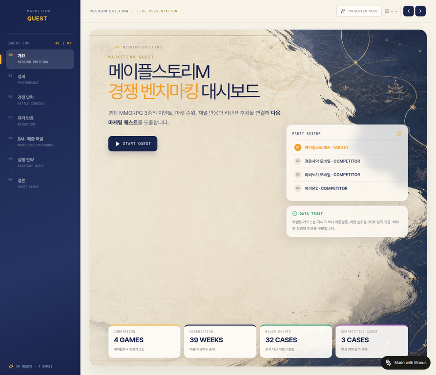

# MARKETING QUEST

메이플스토리M 경쟁 벤치마킹 및 매출 성장 기회 발굴 인터랙티브 대시보드입니다. 경쟁 MMORPG 3종의 공개 시장 반응, 유저 후킹, 공개 BM 구조를 비교해 메이플스토리M이 내부 데이터로 먼저 검증할 매출 성장 후보를 좁힙니다.

## Live Dashboard

[Open the live MARKETING QUEST dashboard](https://mktquestdash-kfhuh6sd.manus.space/)



## Quick Navigation

| 자료 | 링크 |
|---|---|
| Live Dashboard | [mktquestdash-kfhuh6sd.manus.space](https://mktquestdash-kfhuh6sd.manus.space/) |
| Presentation | [`presentation/`](./presentation/) |
| Executive Brief | [`presentation/02_마케팅퀘스트_임원용_핵심요약_최종본.pdf`](./presentation/02_마케팅퀘스트_임원용_핵심요약_최종본.pdf) |
| Q&A Defense Book | [`presentation/README.md`](./presentation/README.md) — 현재 PDF는 MISSING FILE |
| Research | [`research/`](./research/) |
| Data Validation | [`research/datalab/`](./research/datalab/) |
| Project Documentation | [`docs/`](./docs/) |
| Representative Preview | [`preview/01_overview.png`](./preview/01_overview.png) |

## Target / Benchmark

| 구분 | 내용 |
|---|---|
| Target | 메이플스토리M |
| Benchmarks | 검은사막 모바일 · 마비노기 모바일 · 아이온2 |
| Analysis period | 2025-11-17~2026-08-10, 39주 |
| Core data | 게임·이용자수 순위, NAVER DataLab 검색 관심, 공식 이벤트·업데이트·채널, 후킹·평판, 공개 BM 구조 |

## Analysis Flow

`시장 반응 → 경쟁 압력 → 유저 반응 → BM·매출 퍼널 → 검증 우선순위 → 전략`

대시보드는 Mission Briefing, Performance, Battle Console, Retention, Monetization Funnel, Strategy Quest, Quest Clear의 7개 발표 상태로 구성됩니다. [`preview/`](./preview/)에서 공개 배포본의 대표 화면을 확인할 수 있습니다.

## Key Market Signals

| 신호 | 검증된 값 | 해석 경계 |
|---|---:|---|
| 게임(매출) 순위 | 87 → 34위 | 실제 매출액이 아닌 순위 |
| 이용자수 순위 | 69 → 33위 | 절대 이용자수가 아닌 순위 |
| 관측 내 최고 게임(매출) 순위 | 21위 / 2026-08-03 | 관측 기간 내 최고 순위 |
| Search Peak | 0.90 / 2026-07-27 | 절대 검색량이 아닌 상대지수 |
| 최근 4주 상대지수 | 0.23 → 0.49 / +117.2% | 검색 관심의 상대 변화이며 매출 효과가 아님 |

## Evidence Principle

> **PUBLIC EVIDENCE → PERFORMANCE SEPARATION → INTERNAL VALIDATION → DECISION SCOPE**
>
> **공개 확인 → 실제 성과와 분리 → 내부 검증 → 판단 범위**

매출 순위는 실제 매출액이 아니며, NAVER DataLab 검색 관심은 절대 검색량이 아닌 공통 상대지수입니다. 이벤트와 순위의 동시 움직임은 직접 인과로 단정하지 않습니다. 검색 관심 Retention은 실제 이용자 Retention이 아니며, 공개 BM 구조는 실제 결제 성과를 의미하지 않습니다.

## Data Validation

기본 검색 관심 차트는 공식 게임명 4개를 하나의 NAVER DataLab 주간 요청에 넣은 공통 상대지수 프레임을 사용합니다. 관측 범위는 39주이며, 별칭 포함·장기 기간 결과는 별도 검증 산출물로 보관합니다. 검은사막 모바일 이용자수 순위의 결측은 보간하지 않습니다. 자세한 정의는 [`docs/DATA_DICTIONARY.md`](./docs/DATA_DICTIONARY.md)와 [`docs/EVIDENCE_BOUNDARY.md`](./docs/EVIDENCE_BOUNDARY.md)를 참조하십시오.

## Repository Structure

```text
client/                 React/Vite 실행 소스와 런타임 데이터
server/                 프로덕션 서버 진입점
shared/                 공유 상수
patches/                의존성 패치
scripts/                DataLab 전처리·검증 스크립트
docs/                   프로젝트 문서·QA·canonical 데이터 산출물
presentation/           최종 발표 산출물과 누락 자료 안내
research/               큐레이션된 DataLab·BM 조사자료
preview/                공개 대시보드 대표 PNG
```

실행 데이터는 `client/src/data/`에 있으며 runtime import path를 변경하지 않습니다. `research/`는 근거 확인을 위한 복사본과 문서를 보관합니다.

## Tech Stack

React 19, Vite, TypeScript, Tailwind CSS, Recharts, Wouter, Node/Express build entry를 사용합니다. 실제 명령은 `package.json`을 기준으로 합니다.

## Run Locally

```bash
pnpm install
pnpm run check
pnpm run build
pnpm dev
```

## Further Documentation

- [`docs/PROJECT_OVERVIEW.md`](./docs/PROJECT_OVERVIEW.md)
- [`docs/DATA_DICTIONARY.md`](./docs/DATA_DICTIONARY.md)
- [`docs/EVIDENCE_BOUNDARY.md`](./docs/EVIDENCE_BOUNDARY.md)
- [`docs/DEPLOYMENT_GUIDE.md`](./docs/DEPLOYMENT_GUIDE.md)
- [`docs/INPUT_AUDIT.md`](./docs/INPUT_AUDIT.md)
- [`research/README.md`](./research/README.md)
- [`presentation/README.md`](./presentation/README.md)

## License / Usage Note

이 저장소는 발표형 포트폴리오 프로젝트입니다. 공개 자료와 검증된 정적 데이터의 해석 경계를 문서에서 함께 확인해야 하며, 공개 데이터만으로 실제 결제 성과나 매출 인과를 확정하지 않습니다.
